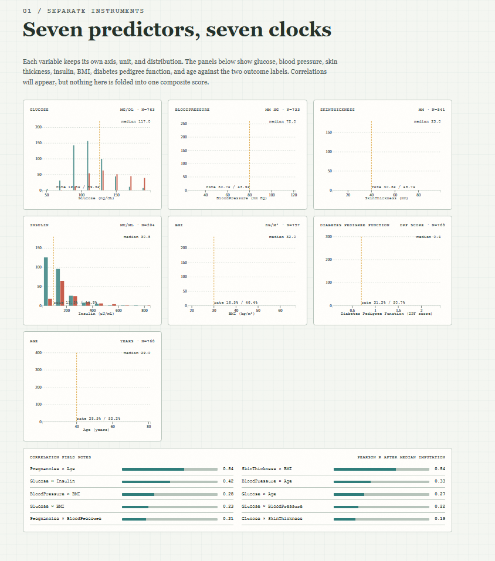
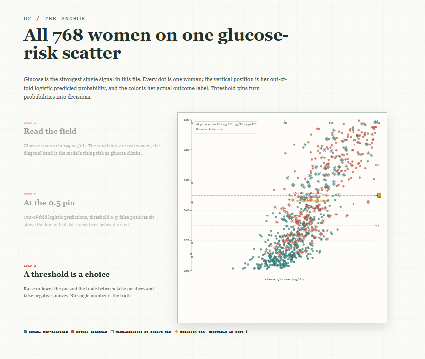
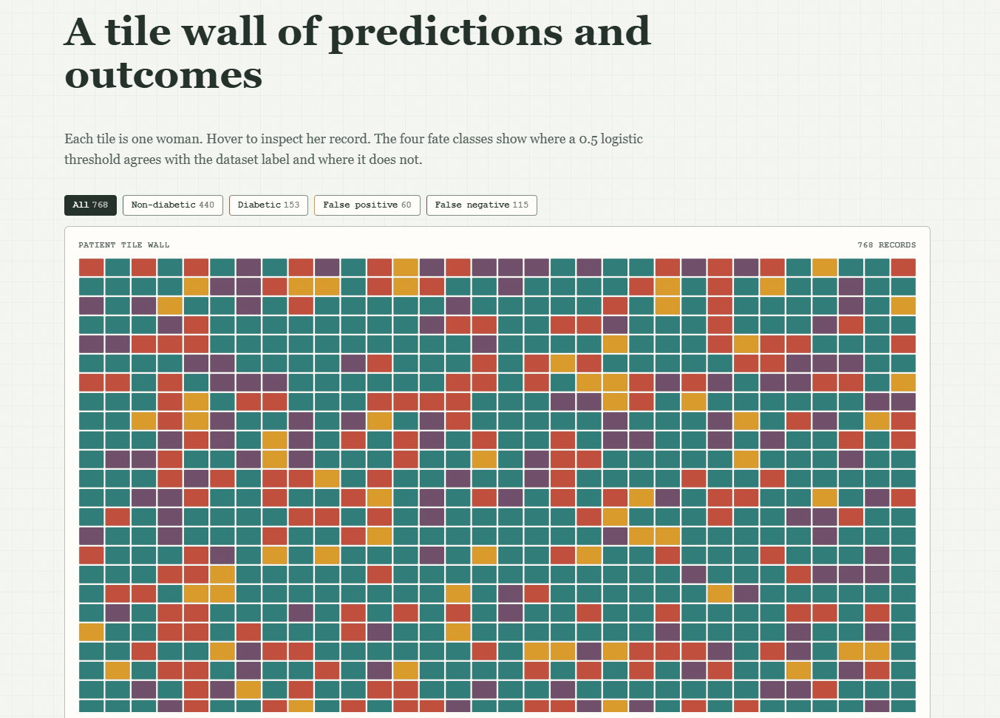
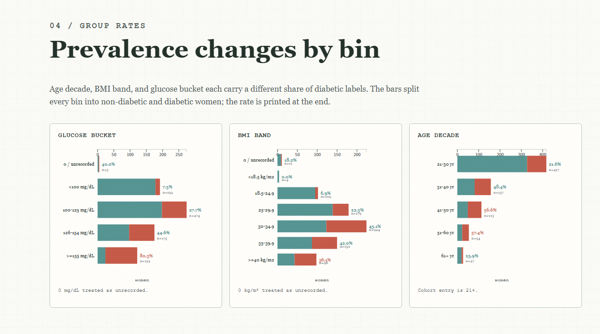
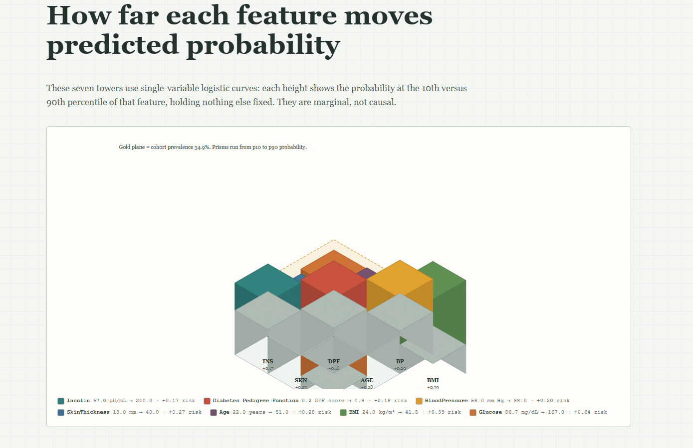
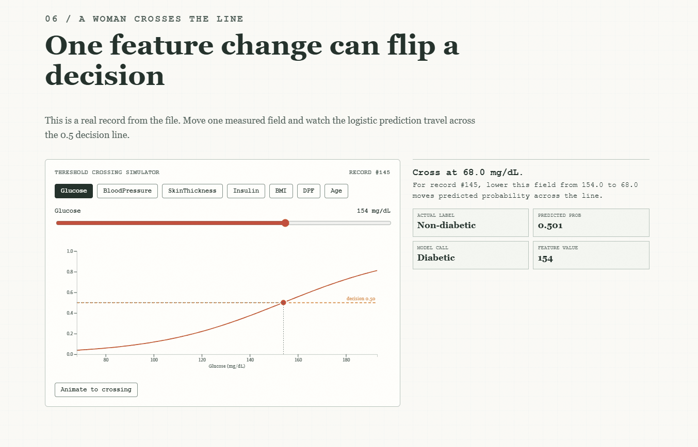
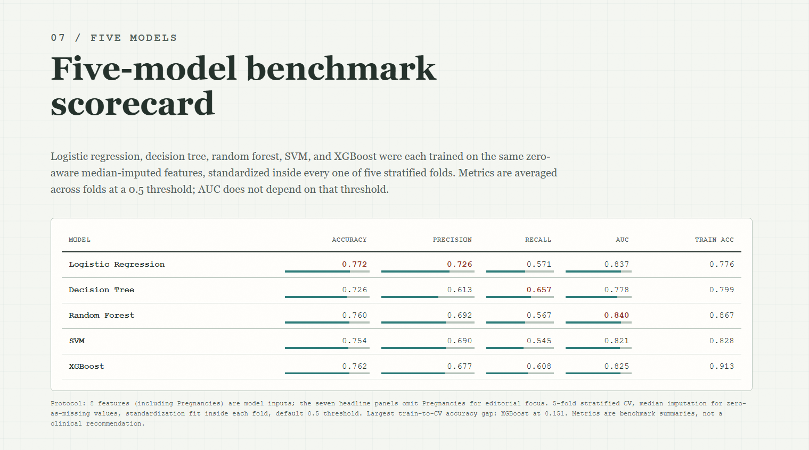
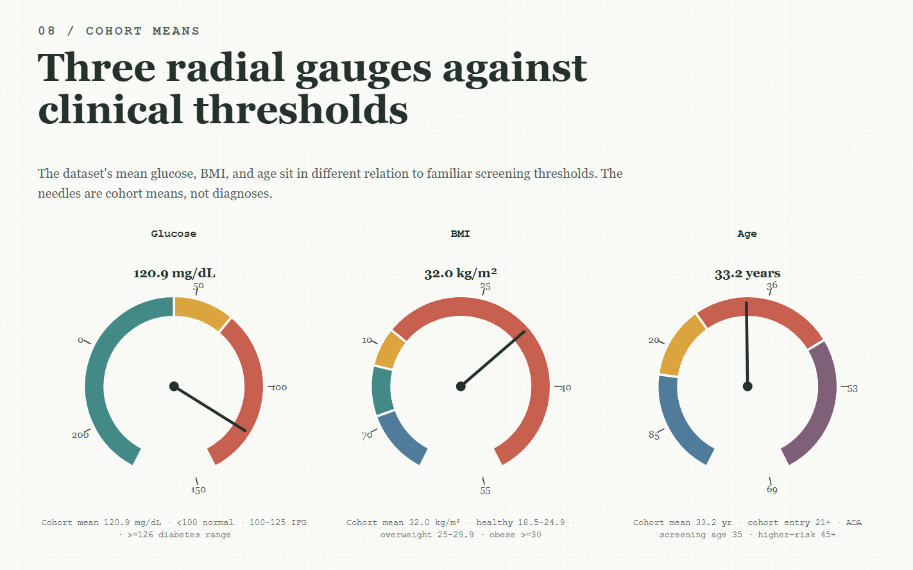
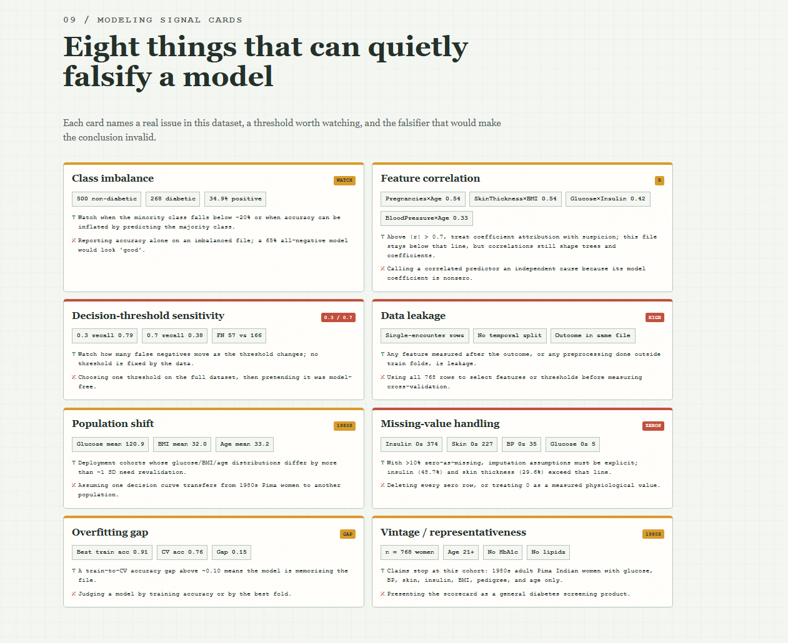

# Diabetes Is Not One Number

> 糖尿病不是单一数字：一个基于 D3.js 的滚动式数据故事（scrollytelling data essay）。

## 项目简介
数据集来源：糖尿病风险预测数据集_数据集-阿里云天池（https://tianchi.aliyun.com/dataset/216181）

参考模板：Shipping Is Not One Cycle — three freight markets, three clocks（https://nuesj4c5tehcg.kimi.page/?id=2079218579525668864&share_id=19f7fe14-b372-82c3-8000-00006c6fc643）

本项目使用 1980 年代美国凤凰城 Pima 印第安女性糖尿病数据集（Pima Indians Diabetes Dataset），把 768 位女性的健康记录做成了一页交互式数据故事。页面反复强调一个观点：糖尿病不能用某一个数字概括。七个预测指标各自保留自己的单位、分布和故事，不会被合并成一个复合评分。

这是一个数据展示与说明项目，不是临床诊断工具。

## 页面功能

页面共包含九个章节：

1. **Seven fields**：七个预测指标的分布与相关性，每个变量单独成图。
   
2. **Glucose-risk**：768 位女性全部呈现在一张血糖风险散点图上，支持调整判定阈值。
   
3. **768 fates**：用 768 个格子组成的“命运墙”，展示每位女性的结局。
   
4. **Group rates**：按不同分组观察糖尿病患病率。
   
5. **Feature risk**：一次只看一个变量，展示该变量与风险的关系。
   
6. **Crossing**：阈值穿越模拟器，演示“一位女性越过判定线”的过程。
   
7. **Five models**：五种模型的对比基准表。
   
8. **Cohort means**：患病与未患病群体的指标均值对比。
   
9.  **Model signals**：各建模信号的可视化卡片。
    

## 数据说明

- 数据来源：UCI Machine Learning Repository，Pima Indians Diabetes Database
- 记录数量：768 位 21 岁以上的女性
- 特征变量：Pregnancies、Glucose、BloodPressure、SkinThickness、Insulin、BMI、DiabetesPedigreeFunction、Age
- 结果标签：Outcome（0 = 未患病，500 人；1 = 患病，268 人）
- 缺失处理：Glucose、BloodPressure、SkinThickness、Insulin、BMI 中的 0 值被视为可能的缺失记录，而不是真实测量值
- 数据局限：数据来自 1980 年代的单一人群，不能直接推广到其他人群

## 项目结构

```text
Diabetes Is Not One Number/
├── diabetes.csv              # 原始数据
├── outputs/                  # 可视化网页，可直接用浏览器打开
│   ├── index.html
│   └── assets/
│       ├── app.js            # 页面逻辑与图表绘制
│       ├── d3.min.js         # D3.js 库
│       ├── diabetes-data.js  # 预处理后的数据
│       └── styles.css        # 页面样式
└── README.md
```

## 运行方式

直接用浏览器打开 `outputs/index.html` 即可，无需安装依赖，也不需要启动本地服务器。所有图表都使用项目自带的 D3.js 渲染。

## 技术栈

- HTML
- CSS
- JavaScript
- D3.js

## 免责声明

本项目中的图表和模型仅用于数据展示与学习，不构成任何医疗建议，也不能用于诊断或治疗。